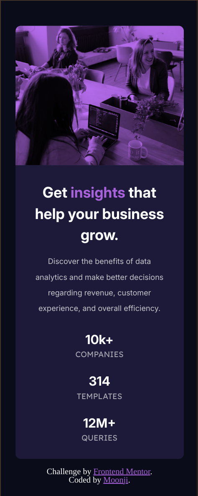

# Frontend Mentor - Stats preview card component solution

This is a solution to the [Stats preview card component challenge on Frontend Mentor](https://www.frontendmentor.io/challenges/stats-preview-card-component-8JqbgoU62). Frontend Mentor challenges help you improve your coding skills by building realistic projects. 

## Table of contents

- [Overview](#overview)
  - [The challenge](#the-challenge)
  - [Screenshot](#screenshot)
  - [Links](#links)
- [My process](#my-process)
  - [Built with](#built-with)
  - [What I learned](#what-i-learned)
  - [Useful resources](#useful-resources)
- [Author](#author)
- [Acknowledgments](#acknowledgments)


## Overview

### The challenge

Users should be able to:

- View the optimal layout depending on their device's screen size

### Screenshot

<ins>Frontend Mentor's Desktop Design</ins>


<ins>My Desktop Solution</ins>


<ins>Frontend Mentor's Mobile Design</ins>


<ins>My Mobile Solution</ins>




### Links

- Solution URL: [Git hub](https://github.com/moonji-spoonji/Stats-Preview-Card-Component)
- Live Site URL: [Netlify](https://stats-preview-card-comp-moonji.netlify.app/)


## My process

### Built with

- Semantic HTML5 markup
- CSS custom properties
- Flexbox
- CSS Grid

### What I learned

The background-blend-mode CSS property is an interesting and important aspect of this project I had to learn about. I am sure there are other methods of creating an overlay type of effect for the card image, but I searched for a solution and this property was suggested. 
To use this property, you must have a background-image and a background-color and choose "overlay" for the background-blend-mode property to mix the image and color. 

```css
.covered {
  display: block;
  
  background-image: url("images/image-header-desktop.jpg");
  background-repeat: no-repeat;
  background: hsla(277, 98%, 24%, 0.624);
  background-blend-mode: overlay;
  
  border-radius: 0 10px 10px 0;
}
```

### Useful resources

- [W3Schools](https://www.w3schools.com/cssref/pr_background-blend-mode.php) - This is an amazing resource which helped me make an overlay for the image on the card (which I chose to make a background).

- [WP Engine](https://wpengine.com/resources/css-blend-modes/#:~:text=Using%20the%20background%2Dblend%2Dmode,other%20background%20images%2C%20behind%20it.) - This is a more in-depth article on CSS Blend Modes!


## Author

- Frontend Mentor - [@moonji-spoonji](https://www.frontendmentor.io/profile/moonji-spoonji)


## Acknowledgments

This is where you can give a hat tip to anyone who helped you out on this project. Perhaps you worked in a team or got some inspiration from someone else's solution. This is the perfect place to give them some credit.
